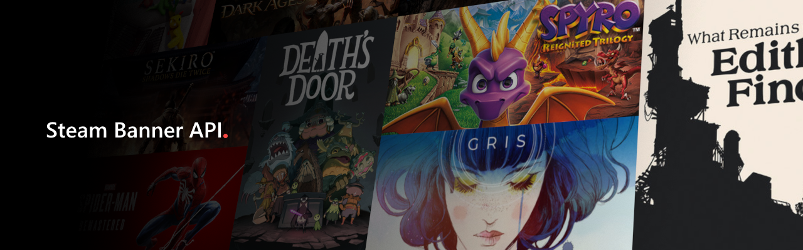

## Table of Contents

- [Description](#description)
- [Usage](#usage)
    - [Search by Game IDs](#search-by-game-ids)
    - [Search by User ID](#search-by-user-id)
    - [Query Parameters](#query-parameters)

## Description
An API for obtaining Steam game banners with custom search filters. It provides a workaround to the limitations of the Steam Web API allowing more advanced filtering for obtaining game image banners. 

## Usage

### Search by Game IDs
**Endpoint:** `/api/game?...`

**Method:** `GET`

**JSON Body:**
```
{
    // Accepts an array of Steam appids.
    "game_ids": [1567440, 1599020, 1599020]
}
```

**Required Query Parameters:**
- `bannertype`

### Search by User ID
**Endpoint:** `/api/profile/{user_id}?...`

**Method:** `GET`

**Required Path Parameters:** 
- ``user_id``

**Required Query Parameters:**
- `bannertype`
- `completed`

### Query Parameters
#### `bannertype` (required)
- `box-art` - returns game box art
- `header`- returns game header
#### `completed` (required for `/profile` route)
- `true` - returns games completed by user
- `false` - returns all games regardless of completion status
