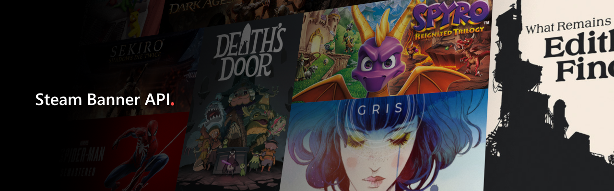

## Description
An API for obtaining Steam game banners with custom search filters. It provides a workaround to the limitations of the Steam Web API allowing more advanced filtering for obtaining game image banners. 

## Usage

### Search by Steam Profile
`steambannerapi.com/api/v1/profile/:uid`

**Method:** `GET`

**Description:**
<p>Obtain banners for games from a respective user's library. Replace the <code>:uid</code> path parameter with a Steam user's ID which can be located in the profile URL of a user's profile. </p>

**Example:** <br>

```
curl GET https://steambannerapi.com/api/v1/profile/76561198088306706/
```

### Search by Game IDs
`steambannerapi.com/api/v1/game-ids`

**Method:** `GET`

**Description:**
<p>Obtain banners by sending an array of game IDs in your request payload.</p>

**Example:** <br>
```
curl -X GET steambannerapi.com/api/v1/game-ids
     -H 'Content-Type: application/json'
     -d '{ games: [2915460, 1586800, 2575900] }'
```

### Optional ```filter=``` Parameter

**Description:**
<p>You can specify whether you want the response to return box art or banners. By default, the API returns banners, but if you want to explicitly specify whether you want banners or box art, you can use the ```filter=``` query parameter.</p>

**Examples:**

```
# Returns game box art.
https://steambannerapi.com/api/v1/profile/76561198088306706/?filter=box-art

# Returns banners if circumstances call for explicit declaration.
https://steambannerapi.com/api/v1/profile/76561198088306706/?filter=banner
```